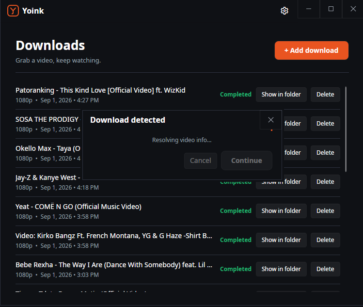
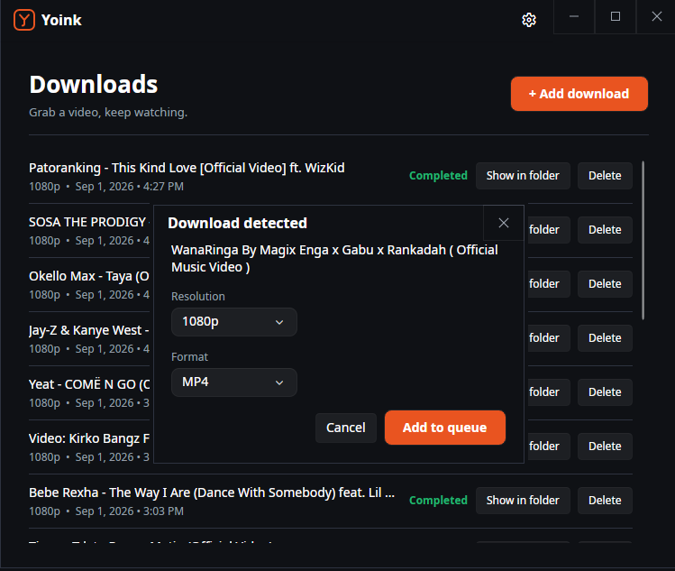
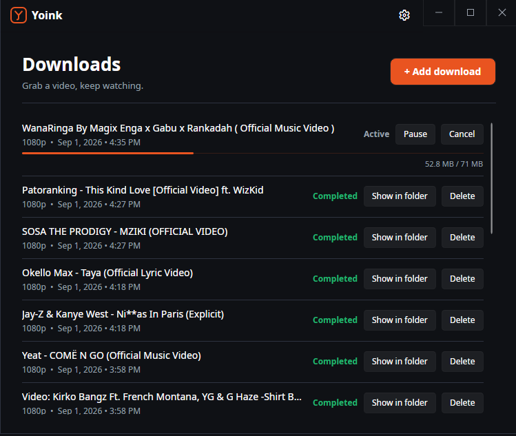
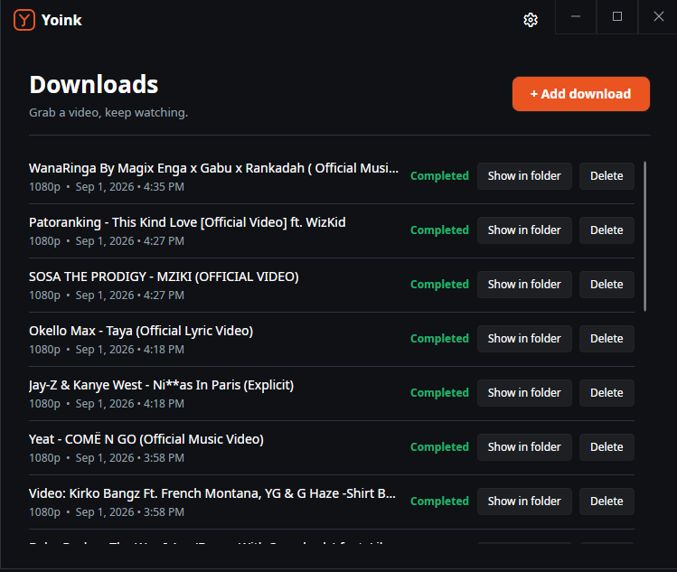
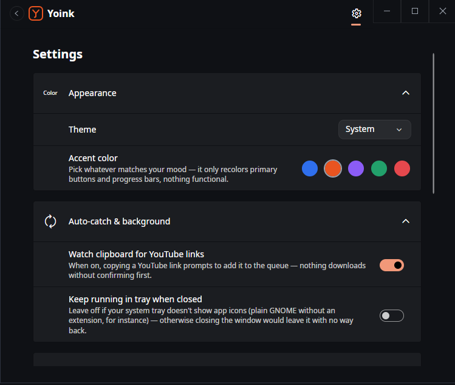
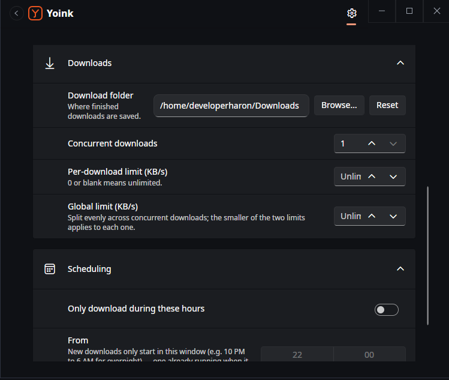

# Yoink

Grab a video, keep watching. Yoink is a free, source-available download manager — it started as a YouTube
downloader and is growing into a general-purpose one, built to feel like a real desktop app on Linux rather
than an afterthought next to Windows.

It's a hobby project, built purely because making it was fun — see [License](#license) below for what that
means for how you can use it.

## What it is

Paste a YouTube URL, pick a resolution, and Yoink queues it up: resolves the video via `yt-dlp`, downloads
video and audio, merges them with `ffmpeg`, and lands the finished file on disk — all visible in a live
queue you can pause, resume, retry, or reorder. Copy a YouTube link to your clipboard and it offers to grab
that too. Close the window and it keeps working from the tray, with a desktop notification when each
download finishes or fails.

Built with [Avalonia](https://avaloniaui.net/) on .NET 10, so it runs the same way on Linux, Windows, and
macOS rather than being tied to Windows Forms.

## Screenshots

<table>
<tr>
<td width="50%">

**Clipboard auto-catch** — copy a YouTube link, and Yoink offers to grab it, no browser extension required.



</td>
<td width="50%">

**Pick a resolution and format** — resolved from what that specific video actually offers, not a guessed list.



</td>
</tr>
<tr>
<td width="50%">

**A live queue** — pause or cancel any download in progress, with real-time size and speed.



</td>
<td width="50%">

**History that never disappears** — every download, completed or not, stays visible.



</td>
</tr>
<tr>
<td width="50%">

**Appearance & auto-catch** — theme, accent color, and clipboard watching.



</td>
<td width="50%">

**Downloads & scheduling** — download folder, concurrency, speed limits, and quiet hours.



</td>
</tr>
</table>

## Download

There's no pre-built download yet — packaging is still pending, Ubuntu first (a self-updating AppImage),
with Windows and macOS to follow once that's sorted. Once it's out, it'll be a straight download from this
repo's [Releases page](https://github.com/developerharon/Yoink/releases) — no separate
site or account needed — and the app checks for new releases on its own from then on, prompting before it
downloads or installs anything. Until then, running it from source is the way to use it — see "Using it"
below.

## Using it

### Prerequisites

- [.NET 10 SDK](https://dotnet.microsoft.com/download)

Yoink also needs [`yt-dlp`](https://github.com/yt-dlp/yt-dlp) (resolves and downloads every video) and
[`ffmpeg`](https://ffmpeg.org/download.html) (merges the separately-downloaded video and audio into one
file), but you don't need to install either yourself: on first launch, Yoink checks for both on `PATH`
and, for whichever it can't find, downloads the current official build straight into its own config
folder and keeps that copy fresh from then on, riding the same daily check as its own update check. If
you'd rather manage them yourself (a distro package, a version you're pinning, etc.), just put them on
`PATH` first and Yoink leaves them alone.

### Run it

1. Clone the repo.
2. Run it:
   ```
   dotnet run --project Yoink
   ```
3. Paste a YouTube URL, pick a resolution, and click "+ Add download".

## Features

- **Resumable downloads** — a killed or crashed download picks up where it left off instead of restarting.
- **Any resolution, reliably** — video and audio download separately and get merged locally, so quality
  isn't limited to whatever YouTube happens to still serve pre-merged.
- **A real download queue** — pause, resume, cancel, retry, and reorder; every download, completed or
  failed, stays visible as history rather than disappearing.
- **Clipboard auto-catch** — copy a YouTube link and Yoink offers to download it, no browser extension
  required.
- **Runs in the background** — a tray icon keeps it going with the window closed, with a desktop
  notification (Linux) when each download finishes or fails.
- **Speed limits, concurrency & scheduling** — cap bandwidth per download or globally, run several
  downloads at once, or restrict downloading to certain hours (overnight, say).
- **One settings screen** for all of it — theme, clipboard watching, tray behavior, speed limits,
  concurrency, and scheduling.
- **Checks for updates on its own** (once installed from a real release, not a source build) — silently,
  once a day, and always asks before downloading or installing anything.

## Contributing

You can clone it and improve it, create a new branch and work on it, or contribute in any other way.

Please comment and contribute to the project — I'm definitely not a pro, lol.

## License

Yoink is licensed under the [PolyForm Noncommercial License 1.0.0](LICENSE.md) — free to use, modify, fork,
and share for any noncommercial purpose, but not to sell or build a paid product or service on top of. I
built this purely for fun, and I want it to stay a free gift to anyone who wants it, not something someone
else profits from.

That restriction is why it's "source-available" above rather than "open source" — the
[Open Source Definition](https://opensource.org/osd) requires letting anyone use software commercially too,
which this license deliberately doesn't. Full terms: [LICENSE.md](LICENSE.md), or the license's own page at
[polyformproject.org](https://polyformproject.org/licenses/noncommercial/1.0.0).
